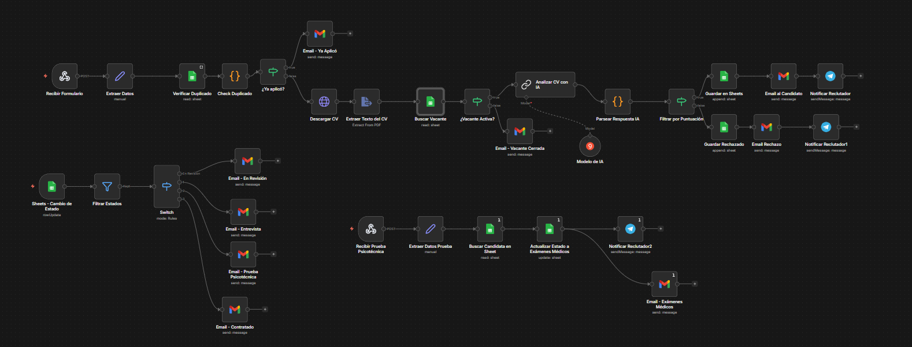
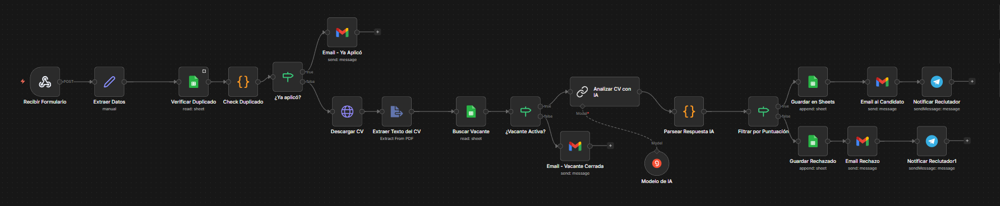
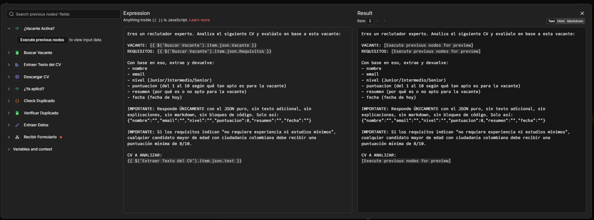
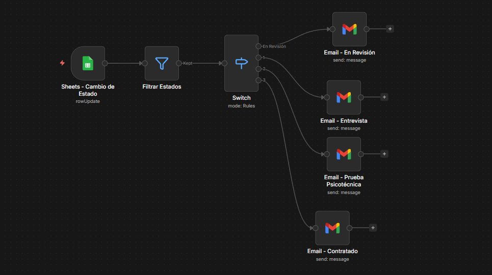
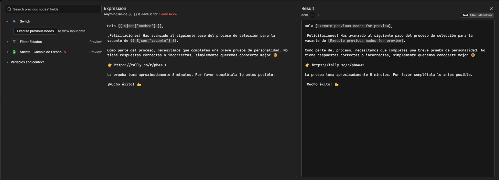
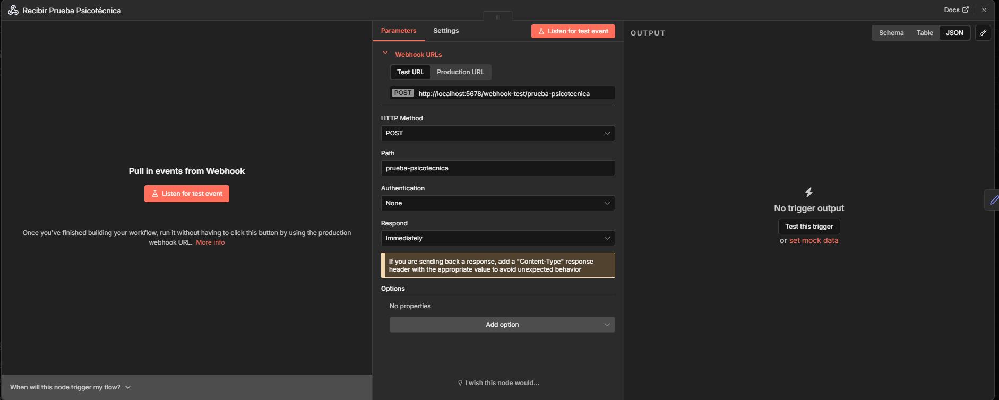
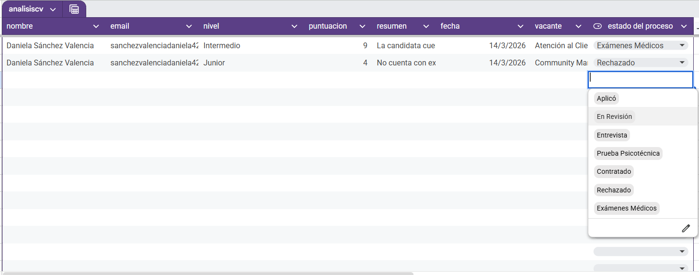
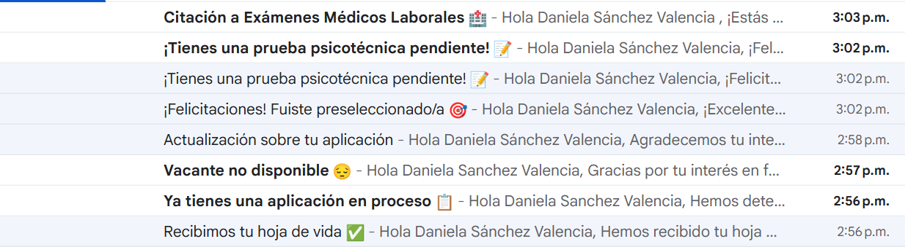
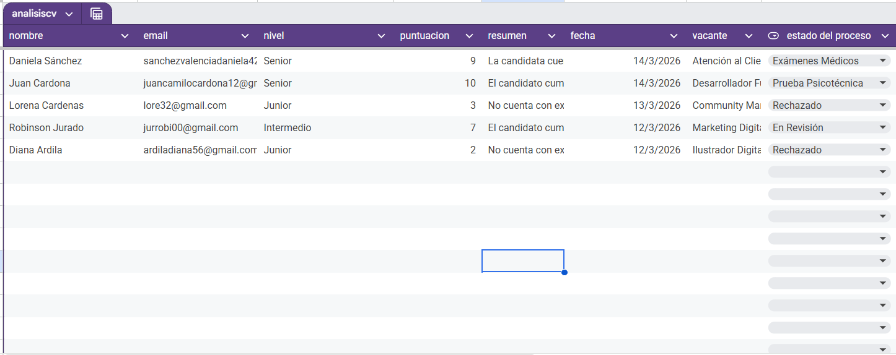
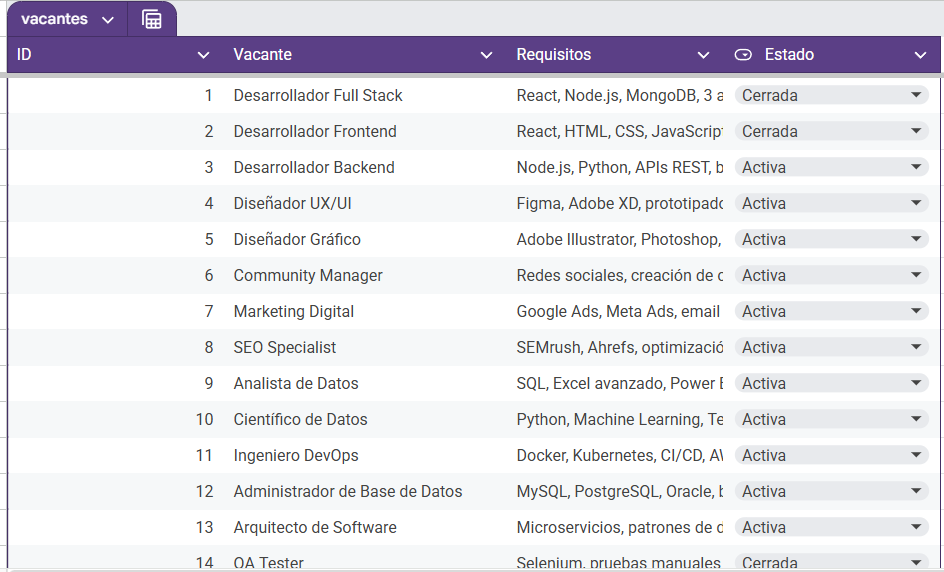

# 🤖 analisis-cv — Automatización de Selección de Personal con n8n

Automatización completa del proceso de selección de personal construida sobre **n8n**. El sistema recibe CVs, los analiza con inteligencia artificial (Groq + LLaMA 3.3 70B), gestiona el pipeline de selección y envía comunicaciones automáticas a los candidatos en cada etapa.

> 📌 **¿Quieres aplicar a una vacante?** → [Formulario de postulación](https://tally.so/r/7RDE8L)

---

## 📋 Tabla de Contenidos

- [Descripción General](#descripción-general)
- [Integraciones y Servicios](#integraciones-y-servicios)
- [Bloques Funcionales](#bloques-funcionales)
  - [Bloque 1 — Recepción y Análisis de CV](#bloque-1--recepción-y-análisis-de-cv)
  - [Bloque 2 — Gestión del Proceso de Selección](#bloque-2--gestión-del-proceso-de-selección)
  - [Bloque 3 — Prueba Psicotécnica](#bloque-3--prueba-psicotécnica)
- [Estados del Proceso](#estados-del-proceso)
- [Comunicaciones Automáticas](#comunicaciones-automáticas)
- [Estructura de Datos — Google Sheets](#estructura-de-datos--google-sheets)
- [Credenciales y Configuración](#credenciales-y-configuración)
- [Catálogo de Vacantes](#catálogo-de-vacantes)
- [Guía de Uso](#guía-de-uso)
- [Notas Técnicas](#notas-técnicas)

---

## Descripción General

El flujo cubre **tres grandes bloques funcionales**:

- **Bloque 1 — Recepción y análisis de CV:** El candidato aplica mediante un formulario web; el sistema descarga el CV, lo analiza con IA y guarda el resultado en Google Sheets.
- **Bloque 2 — Gestión del proceso de selección:** El reclutador avanza al candidato en distintas etapas; el sistema envía correos automáticos en cada transición de estado.
- **Bloque 3 — Prueba Psicotécnica:** Cuando el reclutador marca al candidato en estado "Prueba Psicotécnica", el sistema le envía el formulario automáticamente; al completarlo, se calcula el puntaje, se actualiza el estado a "Exámenes Médicos" y se notifica al reclutador vía Telegram.

---

## Integraciones y Servicios

| Servicio | Rol |
|---|---|
| **n8n** | Motor de automatización. Orquesta todos los nodos y conexiones del flujo |
| **Tally.so** | Plataforma de formularios. Recibe la aplicación inicial del candidato y la prueba psicotécnica |
| **Google Sheets** | Base de datos del proceso. Almacena todos los candidatos en cualquier etapa del pipeline: Aplicó, En Revisión, Entrevista, Prueba Psicotécnica, Exámenes Médicos, Contratado y Rechazado. También contiene el catálogo de vacantes activas |
| **Gmail (OAuth2)** | Canal de comunicación con los candidatos. Envía todos los correos automáticos del proceso |
| **Telegram Bot** | Canal de notificaciones para el reclutador. Alerta en tiempo real de nuevos CVs y cambios de estado |
| **Groq API (LLaMA 3.3 70B)** | Motor de IA. Analiza el CV del candidato contra los requisitos de la vacante y genera una puntuación y resumen |
| **Calendly** | Plataforma de agendamiento. Permite al candidato reservar horario de entrevista virtual |

---

## Bloques Funcionales

### Bloque 1 — Recepción y Análisis de CV

Se activa cuando un candidato envía el formulario de aplicación en Tally.

| Nodo | Tipo | Descripción |
|---|---|---|
| Recibir Formulario | Webhook (POST) | Endpoint: `/recibir-cv`. Recibe el payload de Tally con los datos del formulario |
| Extraer Datos | Set | Mapea los campos: nombre, email, vacante (decodificada desde ID) y URL del CV |
| Verificar Duplicado | Google Sheets (Lookup) | Busca si ya existe una fila con el mismo email Y vacante |
| Check Duplicado | Code (JS) | Evalúa si el resultado contiene `row_number`. Si es así, marca `duplicado: true` |
| ¿Ya aplicó? | IF | Si duplicado = true → Email "Ya Aplicó". Si no → continúa el proceso |
| Email - Ya Aplicó | Gmail | Informa que ya tiene una aplicación activa para esta vacante |
| Descargar CV | HTTP Request | Descarga el PDF del CV desde la URL de Tally como binario |
| Extraer Texto del CV | Extract From File | Extrae el contenido textual del PDF para procesarlo con IA |
| Buscar Vacante | Google Sheets (Lookup) | Obtiene los requisitos de la vacante desde la hoja "Vacantes" |
| ¿Vacante Activa? | IF | Verifica que el estado de la vacante sea "Activa". Si no → Email "Vacante Cerrada" |
| Email - Vacante Cerrada | Gmail | Notifica que la vacante ya no está disponible |
| Modelo de IA | Groq (LLaMA 3.3 70B) | Modelo de lenguaje que procesa el prompt con el CV y los requisitos |
| Analizar CV con IA | LLM Chain | Evalúa el CV y devuelve JSON con: nombre, email, nivel, puntuacion (1-10), resumen y fecha |
| Parsear Respuesta IA | Code (JS) | Extrae y parsea el JSON de la IA. Agrega fecha (zona America/Bogota) y estado "Aplicó" |
| Filtrar por Puntuación | IF | `puntuacion >= 5` → aprobado. `puntuacion < 5` → rechazado |
| Guardar en Sheets | Google Sheets (Append) | Guarda el candidato aprobado con estado "Aplicó" |
| Guardar Rechazado | Google Sheets (Append) | Guarda el candidato rechazado con estado "Rechazado" |
| Email al Candidato | Gmail | Correo de preselección: informa que avanzó en el proceso |
| Email Rechazo | Gmail | Correo amable de rechazo invitando a futuras convocatorias |
| Notificar Reclutador | Telegram | Alerta al reclutador con datos del candidato aprobado |
| Notificar Reclutador1 | Telegram | Alerta al reclutador con datos del candidato rechazado |

#### Lógica de Puntuación de la IA

El modelo recibe:
- El texto completo del CV extraído del PDF
- El nombre de la vacante y sus requisitos (desde Google Sheets)
- Instrucción de responder únicamente con JSON puro

**Regla especial:** Si los requisitos indican que no se requiere experiencia ni estudios mínimos, cualquier candidato mayor de edad con ciudadanía colombiana recibe una puntuación mínima de **8/10**.

**Umbral de aprobación:** `puntuacion >= 5` aprueba — `puntuacion < 5` rechaza.

---

### Bloque 2 — Gestión del Proceso de Selección

Se activa cuando el reclutador modifica el campo `estado del proceso` en Google Sheets.

| Nodo | Tipo | Descripción |
|---|---|---|
| Sheets - Cambio de Estado | Google Sheets Trigger | Polling cada minuto. Se activa con evento `rowUpdate` |
| Filtrar Estados | Filter | Descarta "Aplicó" y "Rechazado". Solo deja pasar: En Revisión, Entrevista, Prueba Psicotécnica, Contratado |
| Switch | Switch | Enruta según el valor exacto del estado hacia el email correspondiente |
| Email - En Revisión | Gmail | "¡Felicitaciones! Fuiste preseleccionado/a" — perfil en revisión detallada |
| Email - Entrevista | Gmail | "¡Te invitamos a una entrevista!" — incluye enlace de Calendly |
| Email - Prueba Psicotécnica | Gmail | "¡Tienes una prueba psicotécnica pendiente!" — incluye enlace a Tally |
| Email - Contratado | Gmail | "¡Bienvenido al equipo!" — notifica la selección final |

---

### Bloque 3 — Prueba Psicotécnica

Este bloque tiene dos partes encadenadas.

**¿Cómo se dispara?**

| Paso | Descripción |
|---|---|
| 1 | El reclutador cambia el estado del candidato a **Prueba Psicotécnica** en Google Sheets |
| 2 | El Bloque 2 detecta el cambio en menos de 1 minuto |
| 3 | Se envía al candidato el email con el enlace: `https://tally.so/r/pbAXJ1` |
| 4 | El candidato completa la prueba de 10 preguntas (~5 minutos) |
| 5 | Tally envía el resultado al Webhook `/prueba-psicotecnica`, activando el sub-flujo |

**Nodos del sub-flujo (Webhook):**

| Nodo | Tipo | Descripción |
|---|---|---|
| Recibir Prueba Psicotécnica | Webhook (POST) | Endpoint: `/prueba-psicotecnica`. Recibe email del candidato y 10 respuestas (escala 1-5) |
| Extraer Datos Prueba | Set | Mapea los 10 campos y calcula `puntaje_total` (máximo 50) |
| Buscar Candidata en Sheet | Google Sheets (Lookup) | Busca al candidato por email para recuperar nombre y vacante |
| Actualizar Estado a Exámenes Médicos | Google Sheets (Update) | Actualiza el estado automáticamente a "Exámenes Médicos" |
| Email - Exámenes Médicos | Gmail | Cita al candidato a realizarse los exámenes médicos de ingreso |
| Notificar Reclutador2 | Telegram | Reporte completo: puntaje total y detalle de las 10 respuestas |

**Dimensiones evaluadas en la prueba:**

| # | Dimensión | # | Dimensión |
|---|---|---|---|
| 1 | Trabajo bajo presión | 6 | Multitarea |
| 2 | Trabajo en equipo | 7 | Orientación a retos |
| 3 | Adaptación al cambio | 8 | Manejo de conflictos |
| 4 | Manejo de errores | 9 | Cumplimiento de normas |
| 5 | Comunicación | 10 | Proactividad |

---

## Estados del Proceso

| Estado | Asignado por | Descripción |
|---|---|---|
| 🟡 **Aplicó** | Sistema automático | CV recibido y aprobado por la IA (puntuación ≥ 5) |
| 🔵 **En Revisión** | Reclutador | El reclutador marcó al candidato para revisión manual |
| 🟢 **Entrevista** | Reclutador | El candidato es citado a entrevista virtual vía Calendly |
| 🟡 **Prueba Psicotécnica** | Reclutador | El candidato completa la prueba de personalidad en Tally |
| 🔵 **Exámenes Médicos** | Sistema automático | Se actualiza automáticamente al recibir la prueba psicotécnica |
| 🟢 **Contratado** | Reclutador | Candidato seleccionado, ingresa al equipo |
| 🔴 **Rechazado** | Sistema automático | CV descartado (puntuación < 5) |

---

## Comunicaciones Automáticas

| Email | Asunto | Disparador |
|---|---|---|
| Email - Ya Aplicó | Ya tienes una aplicación en proceso | Duplicado detectado |
| Email - Vacante Cerrada | Vacante no disponible | Vacante inactiva en Sheets |
| Email al Candidato | Recibimos tu hoja de vida | Puntuación ≥ 5 |
| Email Rechazo | Actualización sobre tu aplicación | Puntuación < 5 |
| Email - En Revisión | ¡Felicitaciones! Fuiste preseleccionado/a | Estado = En Revisión |
| Email - Entrevista | ¡Te invitamos a una entrevista! | Estado = Entrevista |
| Email - Prueba Psicotécnica | ¡Tienes una prueba psicotécnica pendiente! | Estado = Prueba Psicotécnica |
| Email - Exámenes Médicos | Citación a Exámenes Médicos Laborales | Prueba psicotécnica completada |
| Email - Contratado | ¡Bienvenido al equipo! | Estado = Contratado |

---

## Estructura de Datos — Google Sheets

### Hoja: `analisis-cv`

| Columna | Tipo | Descripción |
|---|---|---|
| nombre | Texto | Nombre completo del candidato |
| email | Texto | Email del candidato. Clave de matching para deduplicación y actualizaciones |
| vacante | Texto | Nombre de la vacante a la que aplicó |
| nivel | Texto | Nivel inferido por la IA: Junior, Intermedio o Senior |
| puntuacion | Número | Puntuación de idoneidad asignada por la IA (1-10) |
| resumen | Texto | Justificación breve de la IA sobre la evaluación del perfil |
| fecha | Fecha | Fecha de aplicación en formato d/M/yyyy (zona America/Bogota) |
| estado del proceso | Texto | Estado actual del candidato en el pipeline |

### Hoja: `Vacantes`

| Columna | Tipo | Descripción |
|---|---|---|
| Vacante | Texto | Nombre exacto de la vacante |
| Requisitos | Texto | Requisitos del cargo. Se envían directamente al modelo de IA |
| Estado | Texto | `Activa` o `Cerrada`. Solo se procesan aplicaciones con estado `Activa` |

---

## Credenciales y Configuración

### Credenciales requeridas en n8n

| Servicio | Tipo de Auth | Permisos |
|---|---|---|
| Gmail | OAuth2 | Enviar correos (scope: gmail.send) |
| Google Sheets | OAuth2 | Leer y escribir en el spreadsheet |
| Google Sheets Trigger | OAuth2 (cuenta separada) | Detectar cambios mediante polling |
| Groq API | API Key | Acceso al modelo LLaMA 3.3 70B Versatile |
| Telegram Bot | Bot Token | Enviar mensajes al chat del reclutador |

### Webhooks

| Endpoint | Descripción |
|---|---|
| `POST /recibir-cv` | Recibe el formulario de aplicación desde Tally |
| `POST /prueba-psicotecnica` | Recibe la prueba de personalidad desde Tally |

### Recursos externos

| Recurso | Valor |
|---|---|
| Google Sheets ID | `1ynJPqTjfyIaL-OXWMxiruy2PVOWIWlYkbwcqOE5vEOA` |
| Calendly (Entrevistas) | `https://calendly.com/dsanchex683/entrevista` |
| Tally (Prueba Psicotécnica) | `https://tally.so/r/pbAXJ1` |
| Telegram Chat ID | `8005467511` |

---

## Catálogo de Vacantes

El formulario de aplicación soporta las siguientes 50 vacantes:

| | | |
|---|---|---|
| Desarrollador Full Stack | Analista de Datos | Vendedor Comercial |
| Desarrollador Frontend | Científico de Datos | Ejecutivo de Ventas |
| Desarrollador Backend | Ingeniero DevOps | Atención al Cliente |
| Diseñador UX/UI | Administrador de Base de Datos | Soporte Técnico |
| Diseñador Gráfico | Arquitecto de Software | Administrador de Redes |
| Community Manager | QA Tester | Ciberseguridad |
| Marketing Digital | Product Manager | Ingeniero Cloud |
| SEO Specialist | Project Manager | Ingeniero de Inteligencia Artificial |
| Analista Financiero | Scrum Master | Copywriter |
| Contador | Business Analyst | Editor de Video |
| Recursos Humanos | Abogado Corporativo | Fotógrafo |
| Reclutador | Ingeniero Civil | Ilustrador Digital |
| Logística y Supply Chain | Arquitecto | Animador 3D |
| Coordinador de Operaciones | Ingeniero Industrial | Docente / Capacitador |
| Asistente Administrativo | Médico Ocupacional | Operario de Aseo |
| Secretaria Ejecutiva | Psicólogo Organizacional | |
| Recepcionista | Nutricionista | |
| | Entrenador Personal | |

---

## Guía de Uso

### Para el Candidato

1. Acceder al [formulario de postulación](https://tally.so/r/7RDE8L)
2. Completar: nombre completo, correo electrónico, vacante de interés y cargar el CV en PDF
3. Enviar el formulario
4. Recibir correo de confirmación o rechazo en minutos
5. Si avanza: seguir las instrucciones de cada email (agendar entrevista, completar prueba, realizar exámenes)

### Para el Reclutador

1. Recibir notificación en Telegram con los datos del nuevo candidato
2. Revisar el perfil en Google Sheets (hoja `analisis-cv`)
3. Cambiar manualmente el campo `estado del proceso` al siguiente estado deseado
4. El sistema envía automáticamente el correo al candidato en menos de 1 minuto
5. Para agregar o desactivar vacantes, editar la hoja `Vacantes` del Spreadsheet

---

## Notas Técnicas

**Deduplicación de Aplicaciones**
El sistema verifica la combinación `email + vacante` antes de procesar. Si ya existe un registro con los mismos datos, se envía el correo "Ya Aplicó" y se termina la ejecución.

**Manejo de Errores de Parsing de IA**
El nodo "Parsear Respuesta IA" incluye un bloque `try/catch`. Si el modelo devuelve texto adicional junto con el JSON, se usa una expresión regular para extraer el bloque JSON antes de parsear.

**Zona Horaria**
Las fechas se registran en zona `America/Bogota` (UTC-5) usando `$now.setZone()` de Luxon. Formato: `d/M/yyyy`.

**Polling del Trigger de Sheets**
El nodo "Sheets - Cambio de Estado" hace polling cada minuto. Hay un delay de hasta 60 segundos entre que el reclutador cambia el estado y que el candidato recibe el correo.

**executeOnce en Bloque 3**
Los nodos "Buscar Candidata en Sheet", "Actualizar Estado a Exámenes Médicos" y "Notificar Reclutador2" tienen `executeOnce: true` para prevenir procesamiento múltiple si Tally envía el webhook más de una vez.

**Regla de Puntuación Mínima**
Si los requisitos de la vacante no exigen experiencia ni estudios mínimos, la IA asigna un puntaje mínimo de 8/10 a cualquier candidato mayor de edad con ciudadanía colombiana.

**Centro Médico — Placeholder**
Los datos del centro médico referenciados en el email de "Exámenes Médicos" son **ficticios** y fueron creados como ejemplo. Deben reemplazarse por el centro médico real antes de usar en producción.

---

*Flujo construido en n8n — versión 4.0 — Marzo 2026*
